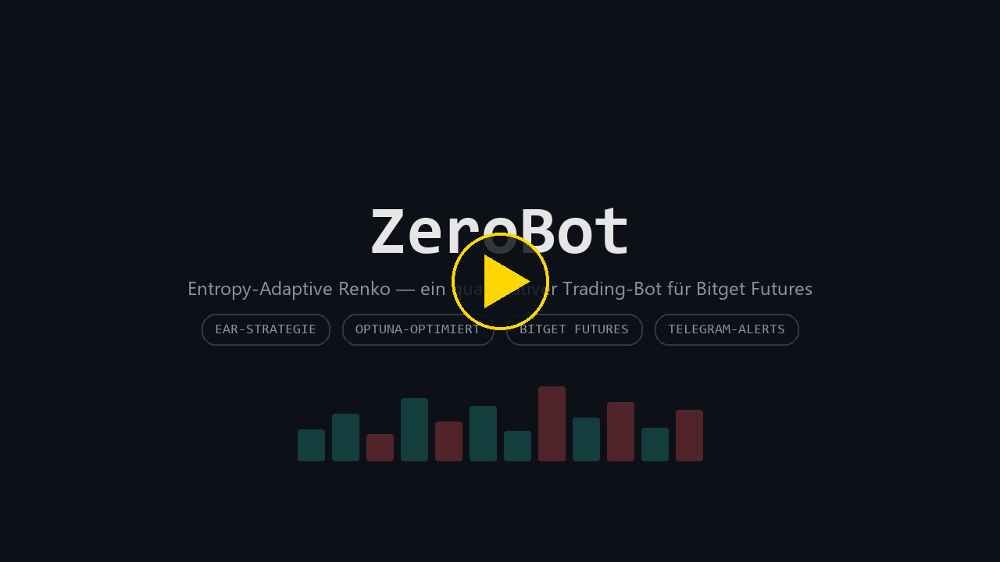
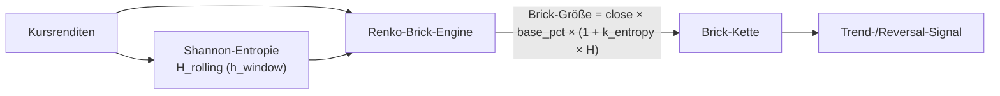
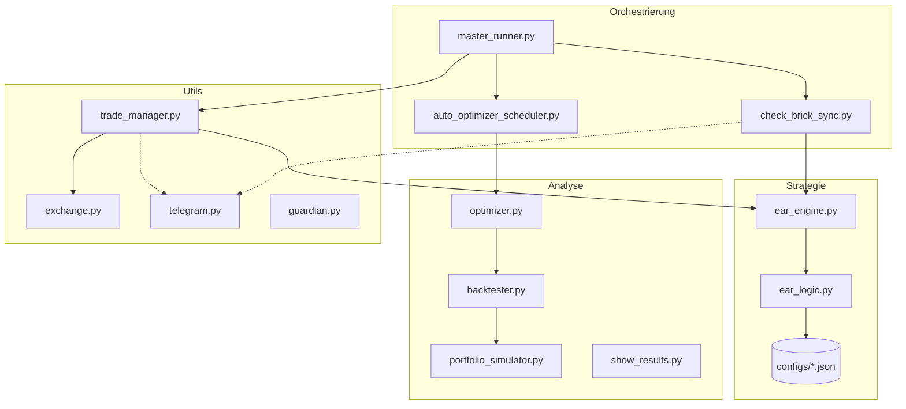
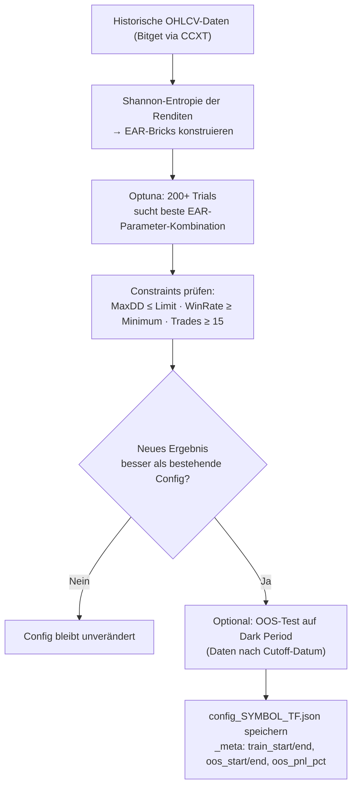
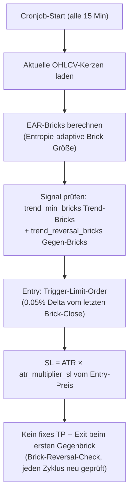
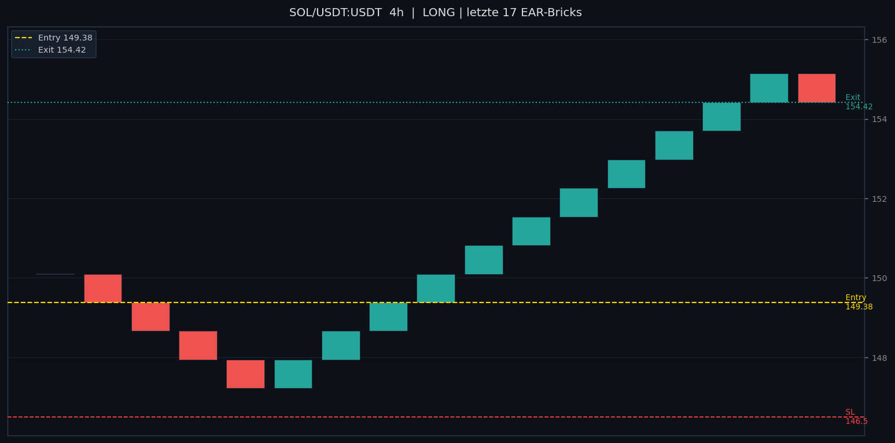
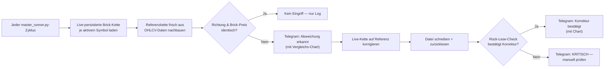
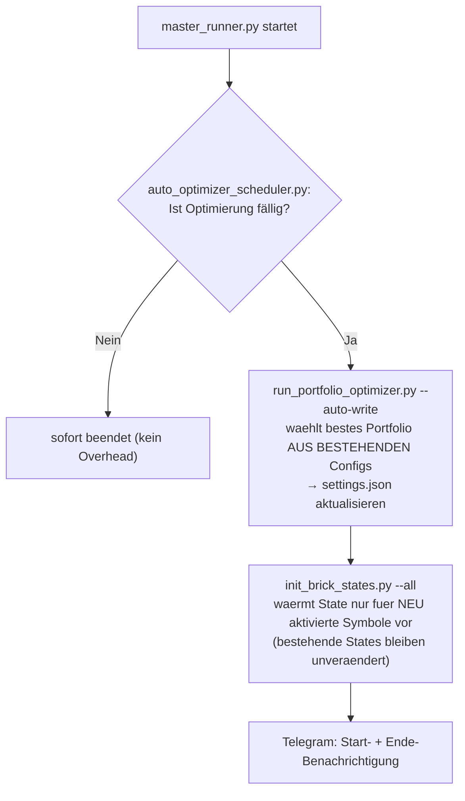
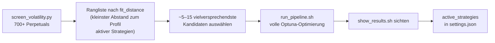

# ZeroBot
### EAR Quant-Trading-Bot für Bitget Futures


Ein quantitativer Crypto-Trading-Bot auf Basis von **Entropy-Adaptive Renko (EAR)**.
Keine willkürlichen Signale — alle Parameter werden via Optuna statistisch optimiert und gegen einen echten Out-of-Sample Dark Period validiert. Eine eingebaute Wächter-Routine vergleicht laufend die live gehandelte Brick-Kette gegen eine frisch berechnete Referenz und korrigiert Abweichungen automatisch.

> ⚠️ **Disclaimer:** Diese Software ist experimentell und dient ausschließlich Forschungszwecken.
> Der Handel mit Kryptowährungen birgt erhebliche finanzielle Risiken. Nutzung auf eigene Gefahr.

---

## Inhaltsverzeichnis

- [Auf einen Blick](#auf-einen-blick)
- [Demo](#demo)
- [Grundidee](#grundidee)
- [Architektur](#architektur)
- [Wie das System funktioniert](#wie-das-system-funktioniert)
- [Konfiguration](#konfiguration)
- [Installation](#installation)
- [Workflow](#workflow)
- [Analysen](#analysen)
- [Automatische Wochenoptimierung](#automatische-wochenoptimierung)
- [Tägliche Verwaltung](#tägliche-verwaltung)
- [Coin-Screening](#coin-screening)
- [Empfohlene Coins und Timeframes](#empfohlene-coins-und-timeframes)
- [Wichtige Regeln](#wichtige-regeln)
- [Abhängigkeiten](#abhängigkeiten)

---

## Auf einen Blick

| | |
|---|---|
| **Strategie** | Entropy-Adaptive Renko (EAR) — Brick-Chain Trend-/Reversal-Signale |
| **Exchange** | Bitget Futures (USDT-M Perpetuals) via CCXT |
| **Ausführung** | `master_runner.py` per Cronjob, alle 15 Minuten |
| **Parametersuche** | Optuna (200+ Trials pro Symbol/Timeframe) |
| **Validierung** | Out-of-Sample Dark Period + 24 statistische Analysen (`run_analysis.sh`) |
| **Live-Überwachung** | `check_brick_sync.py` — vergleicht Live-Brick-Kette gegen Referenz, korrigiert automatisch, meldet per Telegram |
| **Portfolio-Auswahl** | wöchentlich automatisch, inline im Cronjob — wählt aus bestehenden Configs, sucht keine neuen EAR-Parameter (das macht nur `./run_pipeline.sh` manuell) |
| **Aktive Coins/TFs** | dynamisch aus `settings.json → active_strategies` — siehe [Empfohlene Coins und Timeframes](#empfohlene-coins-und-timeframes) für aktuelle Kandidaten |

<p align="right"><a href="#inhaltsverzeichnis">⬆ Inhaltsverzeichnis</a></p>

---

## Demo

[](https://claude.ai/code/artifact/4b4e630e-8416-4eda-a5d7-65a87fad48a5)

**[▶ Video abspielen](https://claude.ai/code/artifact/4b4e630e-8416-4eda-a5d7-65a87fad48a5)** (2:38 min, spielt direkt im Browser) — ein vollständig vertontes Erklärvideo (deutsche Sprachausgabe) durch Idee, Installation, Optimierung, Live-Trading-Zyklus und einen echten Beispiel-Trade. Programmatisch erzeugt (Python/PIL-Frames + Windows-Sprachsynthese + ffmpeg), kein Screen-Recording. Datei liegt zusätzlich unter `assets/demo.mp4` zum direkten Download (GitHub selbst rendert Video-Dateien aus dem Repo nicht als eingebetteten Player, nur eigens über die Weboberfläche hochgeladene — daher der externe Player-Link).

Zusätzlich als interaktive, selbstständig abspielende Web-Seite: **[▶ ZeroBot in Motion](assets/demo.html)** (Pfeiltasten/Klick zum Navigieren, Pause-Button) — lokal im Browser öffnen oder online: [claude.ai/code/artifact/dc0e6f24-e1ac-491e-8185-5e27331ad5ea](https://claude.ai/code/artifact/dc0e6f24-e1ac-491e-8185-5e27331ad5ea).

> Ein echter Screen-Recording-Clip von der Live-Umgebung wäre trotzdem wertvoll, z. B. von:
> 1. Einem `master_runner.py`-Zyklus im Terminal (`.venv/bin/python3 master_runner.py`) — zeigt Brick-Berechnung, Signalprüfung, ggf. Order-Platzierung.
> 2. Einer Telegram-Signal-Benachrichtigung inkl. Brick-Chart (`show_live_charts.py`).
> 3. Einem Brick-Sync-Alarm mit anschließender automatischer Korrektur (`check_brick_sync.py`).
>
> Aufnahme z. B. per OBS oder Terminal-Recorder (z. B. [VHS](https://github.com/charmbracelet/vhs)), als `.mp4` unter `assets/demo_live.mp4` ablegen und einbetten: ``

<p align="right"><a href="#inhaltsverzeichnis">⬆ Inhaltsverzeichnis</a></p>

---

## Grundidee

Klassische Candlestick-Charts rauschen durch Zeit-Noise. **Renko-Bricks filtern Zeit heraus** — ein neuer Brick entsteht erst wenn der Kurs sich um einen definierten Betrag bewegt. EAR erweitert dies: Die Brick-Größe passt sich automatisch der aktuellen Markt-Entropie (Shannon-Entropie der Renditen) an — in ruhigen Märkten kleinere Bricks, in volatilen Märkten größere.

```
Normale 4h-Kerze:  Kurs steigt 0.1% → Kerze gezeichnet  (viel Rauschen)
EAR-Brick:         Brick erst wenn Kurs > close × base_pct × (1 + k_entropy × H_rolling)
                   H_rolling = Shannon-Entropie der letzten h_window Renditen
```



Der Optimizer findet pro Symbol/Timeframe die besten Werte für:

```
base_pct             — Basis-Brick-Größe als % des Kurses  (0.002–0.010)
k_entropy            — Entropie-Gewichtung: wie stark passt sich die Brick-Größe an  (0.4–1.5)
h_window              — Entropie-Glättungsfenster (Anzahl Renditen)  (5–20)
trend_min_bricks      — Mindest-Bricks in Trendrichtung für Signal-Bestätigung  (2–6)
trend_reversal_bricks — Bricks gegen Trend für Entry-Trigger  (1–3)

atr_multiplier_sl    — SL-Abstand vom Entry in ATR-Vielfachen  (1.5–5.0)
risk_reward_ratio    — nur fuer Kelly-Sizing/Walk-Forward-Analysen (1.5–5.0);
                        der echte TP-Exit ist live wie im Backtest der erste
                        Gegenbrick, kein fixer Preis -- siehe Phase 2
leverage              — Hebel  (5–20×)
```

<p align="right"><a href="#inhaltsverzeichnis">⬆ Inhaltsverzeichnis</a></p>

---

## Architektur



<details>
<summary><strong>Vollständige Verzeichnisstruktur</strong></summary>

```
zerobot/
├── master_runner.py               # Cronjob-Orchestrator für Live-Trading
├── run_pipeline.sh                # Optimizer (Optuna findet beste Parameter)
├── show_results.sh                # Ergebnisse, Backtests, Portfolio-Simulation
├── run_analysis.sh                # Renko-spezifische Analysen & Sweeps
├── show_live_charts.py            # Live Brick-Charts aller Strategien per Telegram anfordern
├── check_brick_sync.py            # Live-Brick-Ketten gegen Referenz prüfen/korrigieren (läuft inline im Cronjob)
├── auto_optimizer_scheduler.py    # Automatischer Wochentimer: Neu-Optimierung
├── run_portfolio_optimizer.py     # Automatische Portfolio-Optimierung
├── screen_volatility.py           # Vor-Screening aller Bitget-Perpetuals vor der vollen Pipeline
├── install.sh                     # Erstinstallation auf VPS
├── update.sh                      # Git-Update (sichert secret.json)
├── run_tests.sh                   # Pytest-Sicherheitscheck
├── settings.json                  # Konfiguration (in Git)
├── secret.json                    # API-Keys (NICHT in Git)
│
└── src/zerobot/
    ├── strategy/
    │   ├── ear_engine.py          # EAR-Brick-Berechnung (Entropie-adaptiv) aus OHLCV
    │   ├── ear_logic.py           # Signal-Erkennung auf EAR-Brick-Sequenzen
    │   ├── run.py                 # Entry Point für eine Strategie
    │   └── configs/               # Optimierte Configs pro Symbol/TF (in Git)
    │
    ├── analysis/
    │   ├── optimizer.py               # Optuna Parameter-Suche (EAR-Parameter)
    │   ├── backtester.py              # Historische Simulation (trade_start_date für Dark Period)
    │   ├── oos_tester.py              # Pipeline OOS-Test: schreibt oos_start in Config _meta
    │   ├── portfolio_simulator.py     # Portfolio-Simulation (gemeinsamer Kapital-Pool)
    │   ├── portfolio_optimizer.py     # Beste Strategie-Kombination finden
    │   ├── show_results.py            # Tabellen-Output (Einzel + Portfolio)
    │   │
    │   ├── walk_forward.py            # Rolling Walk-Forward Lookback-Analyse (Dark Period)
    │   ├── fee_impact.py              # Gebühren-Sweep → Break-Even Fee
    │   ├── monte_carlo.py             # 5000 Permutationen → Ruin-Risiko
    │   ├── bootstrap_test.py          # Binomial-Signifikanztest (WR > Zufall?)
    │   ├── param_sweep_walkforward.py # Walk-Forward für RR / ATR-SL / Trailing
    │   ├── param_sensitivity.py       # Tornado: welcher Parameter macht das System fragil?
    │   ├── multitf_analysis.py        # Concurrent Multi-TF Signals → bessere WR?
    │   ├── param_stability.py         # Sind Optuna-Params über Zeit stabil?
    │   ├── correlation.py             # Pearson-Korrelationsmatrix der Configs
    │   ├── kelly_sizing.py            # Kelly% — optimaler Einsatz pro Config
    │   ├── regime_analysis.py         # WR per TREND / RANGE / NEUTRAL / HIGH_VOL
    │   ├── brick_pattern.py           # trend_min × reversal Brick-Gitter
    │   ├── confluence.py              # Mehrfach-Signale → bessere WR?
    │   ├── vol_filter.py              # min_vol_ratio Sweep
    │   ├── time_analysis.py           # WR per Session (Asia / Europe / US)
    │   ├── regime_adaptive.py         # TREND_RR × RANGE_RR Gitter
    │   └── drawdown_duration.py       # DD-Perioden, Erholungsdauer-Statistik
    │
    └── utils/
        ├── exchange.py            # Bitget CCXT Wrapper
        ├── trade_manager.py       # Entry/TP/SL + Trailing Stop
        ├── strategy_list.py       # Geteilte Helper: Symbol/TF-Parsing, verwaiste Positionen
        ├── telegram.py            # Telegram-Benachrichtigungen
        ├── guardian.py            # Crash-Schutz Decorator
        └── timeframe_utils.py     # HTF-Ableitung
```

</details>

<p align="right"><a href="#inhaltsverzeichnis">⬆ Inhaltsverzeichnis</a></p>

---

## Wie das System funktioniert

### Phase 1 — Optimizer (`run_pipeline.sh`)



> Der Optimizer vergleicht jede neue Config mit der bestehenden.
> Nur wenn das neue Ergebnis besser ist, wird die Config überschrieben.

### Phase 2 — Live-Trading (`master_runner.py`)



#### Beispiel-Signal

```
[ZeroBot EAR Signal]
  Symbol:    SOL/USDT:USDT (4h)
  Richtung:  LONG
  EAR-Brick: close × 0.005 × (1 + 0.8 × H)  ≈ 0.72 USDT pro Brick
  Entry:     ~149.38 USDT (Trigger-Limit)
  SL:         146.50 USDT (ATR-basiert, unter der Konsolidierung vor dem Entry)
  TP:         kein fixer Preis -- Exit beim ersten Gegenbrick
  Hebel:      12×
```



Der Chart zeigt exakt die Renderfunktion, die der Live-Bot auch für seine eigenen Telegram-Signale nutzt (`trade_manager._generate_brick_png`) — hier mit einer sauberen Beispielsequenz statt Live-Daten. Nach der Konsolidierung (rote Bricks) bestätigen drei aufeinanderfolgende Up-Bricks den Trendwechsel und lösen den Entry aus; der Trend läuft weiter, bis der erste Gegenbrick (rot, nach dem Hoch) den Exit auslöst — kein fixer Kurs, sondern ein Strukturereignis in der Brick-Kette selbst.

### Phase 3 — Live-Überwachung (`check_brick_sync.py`)

Renko-artige Brick-Ketten sind stark pfadabhängig: Kleine Unterschiede beim Verankern können sich über Tage aufsummieren. `check_brick_sync.py` läuft deshalb **inline bei jedem `master_runner.py`-Zyklus mit** (kein eigener Cronjob nötig) und vergleicht für jede in `settings.json` aktive Strategie die live persistierte Brick-Kette (`artifacts/db/ear_brick_state_*.json`) gegen eine frisch aus den letzten Kursdaten nachgebaute Referenzkette.



Jede Korrektur wird erst nach dem Schreiben durch erneutes Einlesen der Datei verifiziert — nur bei bestätigtem Rück-Lese-Check gilt die Korrektur als erfolgreich. Manueller Trockenlauf (nur Logging, keine Telegram-Nachrichten, keine Korrektur): siehe [Tägliche Verwaltung](#tägliche-verwaltung).

<p align="right"><a href="#inhaltsverzeichnis">⬆ Inhaltsverzeichnis</a></p>

---

## Konfiguration

Zentrale Steuerung über `settings.json`:

```json
{
    "live_trading_settings": {
        "max_open_positions": 7,
        "use_auto_optimizer_results": false,
        "active_strategies": [
            { "symbol": "BTC/USDT:USDT", "timeframe": "4h", "active": true },
            { "symbol": "SOL/USDT:USDT", "timeframe": "6h", "active": true },
            { "symbol": "ETH/USDT:USDT", "timeframe": "4h", "active": false }
        ]
    },
    "optimization_settings": {
        "enabled": true,
        "schedule": {
            "day_of_week": 6,
            "hour": 15,
            "minute": 0,
            "interval": { "value": 7, "unit": "days" }
        },
        "start_capital": 100,
        "start_date": "2024-01-01",
        "end_date": "auto",
        "constraints": { "max_drawdown_pct": 30 },
        "send_telegram_on_completion": true
    }
}
```

| Parameter | Erklärung |
|---|---|
| `max_open_positions` | Maximale gleichzeitig offene Positionen |
| `active_strategies` | Welche Pairs live gehandelt werden (`active: true`) |
| `optimization_settings.enabled` | Automatische wöchentliche Neu-Optimierung ein/aus |
| `optimization_settings.schedule` | Wochentag (0=Mo, 6=So) + Uhrzeit |
| `optimization_settings.start_capital` | Startkapital für den Optimizer |
| `optimization_settings.constraints.max_drawdown_pct` | Maximaler erlaubter Drawdown |

<p align="right"><a href="#inhaltsverzeichnis">⬆ Inhaltsverzeichnis</a></p>

---

## Installation

#### 1. Projekt klonen

```bash
git clone https://github.com/Youra82/zerobot.git
cd zerobot
```

#### 2. Installations-Skript ausführen

```bash
chmod +x install.sh
bash ./install.sh
```

Erstellt die virtuelle Python-Umgebung, installiert alle Abhängigkeiten und legt die Verzeichnisstruktur an.

#### 3. API-Keys eintragen

```bash
nano secret.json
```

```json
{
    "zerobot": [
        {
            "name": "Account1",
            "apiKey": "DEIN_API_KEY",
            "secret": "DEIN_API_SECRET",
            "password": "DEIN_API_PASSWORT"
        }
    ],
    "telegram": {
        "bot_token": "DEIN_BOT_TOKEN",
        "chat_id": "DEINE_CHAT_ID"
    }
}
```

<p align="right"><a href="#inhaltsverzeichnis">⬆ Inhaltsverzeichnis</a></p>

---

## Workflow

#### 1. Coins und Timeframes konfigurieren

```bash
nano settings.json
```

`active_strategies` befüllen — `active: false` reicht zunächst (der Optimizer läuft für alle eingetragenen Pairs).

#### 2. Optimizer ausführen (Pipeline)

```bash
./run_pipeline.sh
```

Der Optimizer sucht via Optuna die besten Parameter pro Symbol/Timeframe. Interaktiv:
- Coins/Timeframes (leer = auto aus settings.json)
- Zeitraum (leer = automatisch nach Timeframe: 4h → 730 Tage, 6h → 1095 Tage)
- Startkapital, Trials, CPU-Kerne
- Optimierungsmodus (Strict: WR+DD+PnL | Best-Profit: nur DD)
- Optional: einzelne Parameter fix setzen statt Optuna frei lassen

Ergebnis: `src/zerobot/strategy/configs/config_SYMBOL_TF.json` pro Pair.

#### 3. Ergebnisse analysieren

```bash
./show_results.sh
```

| Modus | Funktion |
|---|---|
| **1) Einzel-Backtest** | Simuliert jede Config einzeln — zeigt Trades, WinRate, PnL, MaxDD, Hebel, SL ATR, RRR, Trailing, Renko ATR |
| **2) Manuelle Portfolio-Simulation** | Eigene Pair-Auswahl, kombiniertes Kapital, Kompoundierung |
| **3) Automatische Portfolio-Opt.** | Bot wählt das Portfolio mit maximalem PnL bei gegebenem MaxDD-Limit |

#### 4. Strategien live schalten

```bash
nano settings.json
```

```json
{ "symbol": "SOL/USDT:USDT", "timeframe": "6h", "active": true }
```

#### 5. Cronjob einrichten

```bash
crontab -e
```

```
*/15 * * * * cd /root/zerobot && .venv/bin/python3 master_runner.py >> logs/cron.log 2>&1
```

> Der `master_runner.py` ruft beim Start automatisch den `auto_optimizer_scheduler.py` sowie den `check_brick_sync.py`-Wächter auf.
> Der Scheduler prüft ob eine Neu-Optimierung fällig ist und führt sie dann automatisch aus, der Wächter prüft die Brick-Ketten aller aktiven Strategien.
> Separate Cronjobs für beides sind **nicht nötig**.

<p align="right"><a href="#inhaltsverzeichnis">⬆ Inhaltsverzeichnis</a></p>

---

## Analysen

```bash
./run_analysis.sh
```

Analysiert ausschließlich die in `settings.json` unter `active_strategies` eingetragenen Strategien mit `"active": true`. Ergebnisse werden als Chart per Telegram verschickt (Telegram-Credentials aus `secret.json`). Mit `--no-telegram` deaktivierbar.

Jede Analyse ist unten als aufklappbarer Abschnitt dokumentiert — Titel + Kurzbeschreibung sind sichtbar, Details öffnen sich per Klick.

### Priorität 1 — Fundament (Pflichtanalysen vor Live-Betrieb)

<details>
<summary><strong>1) Walk-Forward Lookback-Analyse (Dark Period)</strong> — findet den optimalen Rückblick-Zeitraum für den Auto-Optimizer</summary>

**Was es ist:** Findet den optimalen `backtest_lookback_weeks`-Parameter für den wöchentlichen Auto-Optimizer — also: wie viele Wochen soll der Auto-Optimizer zurückschauen wenn er entscheidet, welche Configs aktiv bleiben?

Dazu simuliert die Analyse den Auto-Optimizer rückwirkend auf dem **Dark Period** (Daten nach dem Pipeline-Cutoff, nie vom Optimizer gesehen): Für jeden Lookback (1W, 2W, 4W, 8W, 12W, 26W) wird Woche für Woche simuliert — welche Configs wären in den letzten N Wochen selektiert worden, und wie hätten sie in der darauffolgenden Woche performt? Der Lookback mit dem besten Calmar gewinnt und wird automatisch in `settings.json` geschrieben.

**Dark Period — kein Lookahead:**
Die Analyse läuft ausschließlich auf dem **dunklen Bereich** der Pipeline — Daten nach dem Optimierungs-Cutoff. Wird automatisch aus der Config-Metadata (`_meta.oos_start`) erkannt. Die IS-Daten (vor dem OOS-Datum) dienen nur als Lookback-Quelle für die Config-Selektion.

```
Pipeline:    [─── IS (Training) ────────────────────] [── OOS (Dark) ──►]
                  2023-03-01          2026-02-28         2026-03-01  heute

Walk-Forward:  IS rollt wöchentlich vorwärts ─────────►
               Jede Woche: IS → beste Config wählen → OOS → Equity akkumulieren
```

**Was ausgewertet wird:**
- Pro Lookback (1W / 2W / 4W / 8W / 12W / 26W): Gesamt-OOS-PnL%, MaxDD%, Calmar, Trades, WR, Leerwochen
- Leerwochen = Wochen in denen keine Config den IS-Filter bestand (kein Trade → Kapital geschützt)
- Bester Lookback = höchster Calmar mit positivem OOS-PnL → wird automatisch in `settings.json` geschrieben

**Kennzahlen erklärt:**
| Kennzahl | Bedeutung | Gut wenn... |
|---|---|---|
| **OOS-PnL%** | Gesamtperformance im Dark Period (nie vom Optimizer gesehen) | > 0% |
| **Calmar** | OOS-PnL% / MaxDD% — risikobereingte Rendite | > 1.0 |
| **MaxDD%** | Maximaler Kapitalrückgang im OOS-Zeitraum | < 25% |
| **Leerwochen** | Wochen ohne selektierte Config — keine Trades, Schutz | niedrig = stabiles System |
| **WR** | Win-Rate der OOS-Trades (EAR: oft 15–25%, kompensiert durch R:R) | relativ zu R:R |

**Wie der beste Lookback in den Auto-Optimizer fließt:**
```
settings.json → optimization_settings → backtest_lookback_weeks: 1
                                                  ↑
                              Ergebnis dieser Analyse (bester OOS-Calmar)
```
Der wöchentliche Auto-Optimizer (`run_portfolio_optimizer.py`) liest diesen Wert und schaut exakt N Wochen zurück wenn er entscheidet, welche Configs aktiv bleiben.

**Interpretation:**
- 1W Lookback besser als 4W/8W → das System reagiert besser auf kurzfristige Regime-Wechsel als auf langfristige Trends
- Alle Lookbacks negativ → Config overfittet auf Trainingsperiode, Pipeline neu ausführen
- Leerwochen > 50% bei kurzen Lookbacks (1W/2W) → zu wenig Trades im IS-Fenster (min_trades erhöhen oder kürzeres TF wählen)

**Beispiel-Output:**
```
★ Bester Lookback: 1 Wochen
  Calmar: 1.7  |  PnL: +16.4%  |  MaxDD: 9.8%  |  Trades: 129  |  WR: 18.6%
→ settings.json aktualisiert: backtest_lookback_weeks = 1
```

</details>

<details>
<summary><strong>2) Slippage & Fee Impact</strong> — testet Empfindlichkeit gegenüber Handelskosten</summary>

**Was es ist:** Testet wie empfindlich die Strategie auf Handelskosten reagiert. Jede Config wird mit Gebührensätzen von 0% bis 0.20% pro Seite simuliert (0.06% = Bitget Taker-Fee).

**Was ausgewertet wird:**
- PnL% und Win-Rate bei jeder Gebührenstufe
- Break-Even Fee: der Gebührensatz bei dem PnL = 0%
- Trade-Häufigkeit (je mehr Trades, desto mehr schaden Gebühren)

**Kennzahlen erklärt:**
| Kennzahl | Bedeutung | Gut wenn... |
|---|---|---|
| **Break-Even Fee** | Maximale Gebühr vor Verlust | > 0.10% (2× Bitget-Rate als Puffer) |
| **PnL-Abfall pro 0.01%** | Wie viel PnL für jede 0.01% Mehrgebühr verloren geht | < 2% PnL-Verlust |
| **Fee-Sensitivität** | Steigung der PnL-Kurve zur Gebühr | Flach = robuster Bot |

**Interpretation:** Break-Even Fee < 0.07% → gefährlich knapp an Bitget-Kosten. Zusätzliche Spread-Kosten auf illiquiden Märkten können bereits zum Verlust führen.

</details>

<details>
<summary><strong>3) Monte Carlo Simulation</strong> — 5000 Permutationen für die echte Ergebnisverteilung</summary>

**Was es ist:** Statt die Trades in historischer Reihenfolge zu simulieren, werden sie 5000× zufällig mit Zurücklegen (Bootstrap-Resampling) neu gemischt. Jede Simulation hat andere Trades, andere Reihenfolge → echte Verteilung möglicher Ergebnisse.

**Was ausgewertet wird:**
- Verteilung der finalen PnL% über alle Simulationen
- Verteilung der maximalen Drawdowns
- Ruin-Wahrscheinlichkeit (Equity < 50%)
- 5./25./50./75./95. Perzentil der PnL

**Kennzahlen erklärt:**
| Kennzahl | Bedeutung | Gut wenn... |
|---|---|---|
| **5. Perzentil (Worst-Case)** | In 95% der möglichen Szenarien ist der PnL besser als dieser Wert | > -20% |
| **95. Perzentil (Best-Case)** | Das obere Ende des realistischen Bereichs | |
| **Ruin-Wahrscheinlichkeit** | Anteil Simulationen mit > 50% Kapitalverlust | < 5% |
| **Median Max-Drawdown** | Mittlerer maximaler Einbruch über alle Simulationen | < 25% |
| **Spread (95. Pz – 5. Pz)** | Breite der Verteilung = Unsicherheit des Systems | Schmal = stabiler |

**Interpretation:** Wenn 5. Perzentil = -7% und 95. Perzentil = +180% → hohe Varianz, glückliche Trade-Reihenfolge könnte Ergebnis stark verzerren. Ziel: Median und 5. Perzentil beide positiv.

</details>

<details>
<summary><strong>4) Bootstrap Signifikanztest</strong> — ist die Win-Rate statistisch echt oder Zufall?</summary>

**Was es ist:** Statistischer Beweis ob die Win-Rate echt ist oder Zufall. Verwendet einen Binomial-Test: Wenn eine Münze 50% Chance hat, wie wahrscheinlich ist es, die beobachtete Win-Rate nur durch Zufall zu erreichen?

**Was ausgewertet wird:**
- p-Wert des Binomial-Tests gegen H0: WR = 50%
- z-Score (Standardabweichungen über Zufall)
- Signifikanz-Niveau (0.01 / 0.05 / 0.10)

**Kennzahlen erklärt:**
| Kennzahl | Bedeutung | Gut wenn... |
|---|---|---|
| **p-Wert** | Wahrscheinlichkeit, das Ergebnis durch Zufall zu erzielen | < 0.05 |
| **z-Score** | Standardabweichungen über der Zufalls-Baseline | > 1.96 (= p < 0.05) |
| **Signifikanzniveau** | p < 0.01 = sehr signifikant, p < 0.05 = signifikant, p > 0.10 = nicht signifikant | |
| **Effektive Trades** | Anzahl Trades in der Analyse (weniger Trades = schwächere Aussagekraft) | ≥ 30 |

**Interpretation:** p-Wert = 0.03 → nur 3% Wahrscheinlichkeit dass die Win-Rate Zufall ist → statistisch signifikantes Signal. Bei < 20 Trades ist kein Test aussagekräftig.

</details>

### Priorität 2 — Parameter-Optimierung (vor Parameteränderungen prüfen)

<details>
<summary><strong>5) RR-Ratio Walk-Forward</strong> — stabilster Risk-Reward-Wert über alle Marktphasen</summary>

**Was es ist:** Testet verschiedene Risk-Reward-Ratios (1.5 bis 4.0) auf jeweils ungesehenen Zeitfenstern. Findet den RRR-Wert der über alle Marktphasen stabil profitabel ist, nicht nur in der Optimierungsperiode.

**Was ausgewertet wird:**
- PnL% pro RRR-Wert, aufgeteilt auf N OOS-Fenster
- Konsistenz-Score pro RRR-Wert
- Optimaler RRR (bester Gesamt-OOS-PnL)

**Kennzahlen:** Gleich wie Walk-Forward (1), aber pro RRR-Wert. Suche nach dem RRR mit bestem Median-PnL bei niedrigstem Konsistenz-Score.

</details>

<details>
<summary><strong>6) ATR-SL-Multiplier Walk-Forward</strong> — stabilster Stop-Loss-Abstand</summary>

**Was es ist:** Wie (5), aber für den Stop-Loss-Abstand (`atr_multiplier_sl`). Testet Werte von 1.0 bis 5.0 × ATR. Enger SL = mehr Trades ausgestoppt, weiter SL = kleinere Positionsgröße bei gleichem Risiko.

**Was ausgewertet wird:**
- PnL%, Win-Rate, Max-DD pro SL-Multiplier auf OOS-Fenstern
- Trade-off: Win-Rate vs. RRR vs. Kapitaleffizienz

**Kennzahlen:** SL-Multiplier vs. PnL-Verteilung. Optimaler Wert hat höchsten Median-OOS-PnL.

</details>

<details>
<summary><strong>7) Trailing Callback Walk-Forward</strong> — optimaler Trailing-Stop-Abstand</summary>

**Was es ist:** Wie (5), aber für den Trailing-Stop-Callback-Prozentsatz (0.2% bis 2.0%). Bestimmt wie eng der Trailing Stop dem Kurs folgt. Zu eng = vorzeitiges Auslösen in Volatilität. Zu weit = zu viel Profit zurückgegeben.

**Was ausgewertet wird:**
- PnL% pro Callback-Wert auf OOS-Fenstern
- Anteil Trades wo Trailing aktiviert wurde vs. TP erreicht

</details>

<details>
<summary><strong>8) Parameter Sensitivity (Tornado-Diagramm)</strong> — welcher Parameter macht das System fragil?</summary>

**Was es ist:** Misst wie empfindlich der PnL auf kleine Parameteränderungen reagiert. Jeder Parameter wird einzeln um ±10%, ±20%, ±30% variiert während alle anderen fixiert bleiben.

**Was ausgewertet wird:**
- PnL-Änderung (absolut und relativ) pro Parametervariation
- Ranking der Parameter nach Einfluss
- Tornado-Chart: breitester Balken = stärkster Einfluss

**Kennzahlen erklärt:**
| Kennzahl | Bedeutung | Gut wenn... |
|---|---|---|
| **Sensitivität** | PnL-Änderung bei ±30% Parametervariation | < 20% PnL-Änderung |
| **Breite des Balkens** | Differenz Best/Worst Case bei Variation | Schmal = robust |
| **Rangliste** | Welcher Parameter ist am kritischsten | |

**Interpretation:** `risk_reward_ratio` mit Balkenbreite 80% → kleiner RRR-Fehler zerstört die Strategie. `vol_filter` mit Balkenbreite 3% → kaum Einfluss. Breite Balken = Overfitting-Risiko auf diesen Parameter.

</details>

### Priorität 3 — Systemverbesserung

<details>
<summary><strong>9) Multi-Timeframe Confirmation</strong> — bestätigt ein zweiter Timeframe das Signal?</summary>

**Was es ist:** Prüft ob ein Signal besser ist wenn mehrere Timeframes desselben Coins gleichzeitig in dieselbe Richtung signalisieren (z.B. BTC 4h Long + BTC 2h Long gleichzeitig).

**Was ausgewertet wird:**
- Win-Rate: Alle Signale vs. nur Signale mit TF-Bestätigung
- Anzahl verbleibender Trades nach Confluence-Filter
- PnL-Vergleich: gefiltert vs. ungefiltert

**Kennzahlen erklärt:**
| Kennzahl | Bedeutung |
|---|---|
| **WR-Verbesserung** | Wie viel steigt die Win-Rate durch TF-Bestätigung |
| **Trade-Reduktion %** | Wie viele Trades werden herausgefiltert |
| **PnL-Änderung** | Verbessert sich PnL trotz weniger Trades |

</details>

<details>
<summary><strong>10) Parameter-Stabilitäts-Analyse</strong> — springen die Optima über die Zeit?</summary>

**Was es ist:** Optimiert die Config auf verschiedenen rollierenden Zeitfenstern neu und vergleicht die optimalen Parameter. Sind `atr_multiplier`, `trend_min_bricks`, `leverage` etc. in allen Perioden ähnlich? Oder springt jede Periode auf andere Werte?

**Was ausgewertet wird:**
- Optima-Werte pro Zeitfenster für jeden Parameter
- Standardabweichung der Optima (niedrig = stabil)
- Visueller Stabilitätsscore pro Parameter

**Kennzahlen erklärt:**
| Kennzahl | Bedeutung | Gut wenn... |
|---|---|---|
| **Stabilitätsscore** | 1 – (Std / Range) pro Parameter | > 0.6 |
| **Std der Optima** | Streuung des besten Parameterwertes über Perioden | Niedrig |
| **Stabilitäts-Ranking** | Welche Parameter sind over alle Phasen konsistent | |

**Interpretation:** `atr_multiplier` Std = 0.05 → sehr stabil. `leverage` Std = 6 → stark marktphasenabhängig → Vorsicht beim Übernehmen des Optimierer-Hebels.

</details>

<details>
<summary><strong>11) Anti-Korrelations-Portfolio</strong> — welche Configs diversifizieren wirklich?</summary>

**Was es ist:** Berechnet die Pearson-Korrelation der wöchentlichen PnL-Verläufe aller aktiven Configs. Zwei Strategien mit negativer Korrelation verlieren nicht gleichzeitig → bessere Diversifikation.

**Was ausgewertet wird:**
- Korrelationsmatrix (NxN für N aktive Configs)
- Minimum-Korrelations-Paar (beste Diversifikation)
- Maximum-Korrelations-Paar (redundante Strategien)
- Portfolio-Durchschnittskorrelation

**Kennzahlen erklärt:**
| Wert | Bedeutung |
|---|---|
| **Korrelation nahe +1.0** | Beide Strategien verlieren/gewinnen gleichzeitig → kein Diversifikations-Nutzen |
| **Korrelation nahe 0** | Unabhängige Strategien → gute Diversifikation |
| **Korrelation nahe -1.0** | Gegenläufig → maximale Absicherung |

**Interpretation:** BTC 4h + ETH 4h haben oft Korrelation > 0.8 (beide reagieren auf BTC-Bewegungen). BTC 4h + XRP 4h oft < 0.5 → bessere Kombination.

</details>

<details>
<summary><strong>12) Kelly Position Sizing</strong> — mathematisch optimaler Einsatz pro Trade</summary>

**Was es ist:** Berechnet den mathematisch optimalen Einsatz pro Trade nach der Kelly-Formel: `Kelly% = (WR × RRR − (1−WR)) / RRR`. Half-Kelly (Kelly/2) ist die empfohlene konservative Version.

**Was ausgewertet wird:**
- Kelly% pro Config
- Half-Kelly% (empfohlener Einsatz)
- Langfristiges Kapitalwachstum bei Kelly- vs. fixer Positionsgröße
- Warnung bei negativem Kelly

**Kennzahlen erklärt:**
| Kennzahl | Bedeutung | Interpretation |
|---|---|---|
| **Kelly%** | Theoretisch optimaler Anteil des Kapitals pro Trade | 5–20% = gesund |
| **Half-Kelly%** | Konservativere Empfehlung (halber Kelly) | Empfohlener Wert |
| **Negativer Kelly** | WR zu niedrig für den RRR → langfristig Verlust garantiert | Strategie überdenken |

**Interpretation:** Kelly = -5% → selbst mit perfektem Timing verliert diese Strategie langfristig Geld. Kelly = 15% → Half-Kelly 7.5% → bei 100 USDT Kapital: 7.50 USDT risikieren pro Trade.

</details>

### Priorität 4–6 — Feintuning

<details>
<summary><strong>13) Regime Performance Analysis</strong> — Win-Rate je Marktphase (TREND/RANGE/HIGH_VOL)</summary>

**Was es ist:** Klassifiziert jeden Trade nach der Marktphase in der er eröffnet wurde und vergleicht die Win-Rate je Phase. Phasen werden via ADX (Trendstärke) und ATR-Ratio (Volatilität) bestimmt.

**Phasen-Klassifizierung:**
| Phase | Bedingung | Typisch |
|---|---|---|
| **TREND** | ADX > 25 | Starke gerichtete Bewegung |
| **RANGE** | ADX < 20 | Seitwärtsbewegung |
| **HIGH_VOL** | ATR > ATR_MA × 1.5 | Crash/Spike — hohe Unsicherheit |
| **NEUTRAL** | Keines der obigen | Normaler Markt |

**Was ausgewertet wird:**
- Win-Rate, Trades, PnL, Max-DD pro Phase
- Empfehlung: In welchen Phasen ist Renko stark/schwach?

**Interpretation:** Win-Rate TREND: 65%, RANGE: 28% → Renko-Signal tritt oft in Trendsituationen auf und funktioniert gut. In Range-Phasen lieber pausieren.

</details>

<details>
<summary><strong>14) Brick-Pattern-Kombinations-Analyse</strong> — optimales trend_min × reversal Gitter</summary>

**Was es ist:** Testet alle Kombinationen aus `trend_min_bricks` (2–6) und `reversal_bricks` (1–3) in einem 5×3-Gitter. Zeigt die optimale Brick-Sequenz-Kombination pro Symbol.

**Was ausgewertet wird:**
- PnL% und Win-Rate pro Kombination als Heatmap
- Optimale Kombination pro Config
- Trade-off: viele kleine Signale (kurze Sequenz) vs. seltene starke Signale (lange Sequenz)

**Kennzahlen erklärt:**
| Kennzahl | Bedeutung |
|---|---|
| **trend_min_bricks** | Mindest-Bricks in Trendrichtung bevor Signal gültig (2 = früh/sensitiv, 6 = spät/stark) |
| **reversal_bricks** | Bricks gegen Trend für Reversal-Bestätigung (1 = schnell, 3 = sicher) |
| **Heatmap-Maximum** | Beste Kombination — oft nicht identisch mit Optuna-Ergebnis |

</details>

<details>
<summary><strong>15) Confluence Score</strong> — verbessert sich die WR bei mehreren gleichzeitigen Signalen?</summary>

**Was es ist:** Zählt wie oft mehrere aktive Configs gleichzeitig in dieselbe Richtung signalisieren (1, 2, 3+ Strategien gleichzeitig). Prüft ob die Win-Rate bei 2+ gleichzeitigen Signalen höher ist.

**Was ausgewertet wird:**
- WR bei N=1, N=2, N=3+ gleichzeitigen Signalen
- Anzahl Signale pro Confluence-Level
- Empfehlung: Mindest-Confluence für bessere Trade-Qualität

**Interpretation:** WR bei 1 Signal: 35%, WR bei 2+ Signalen: 52% → höhere Confluence verbessert die Win-Rate deutlich. Strategie: nur bei 2+ Signalen traden.

</details>

<details>
<summary><strong>16) Volatilitäts-Filter Optimierung</strong> — Sweet Spot für min_vol_ratio</summary>

**Was es ist:** Sweept den `min_vol_ratio`-Parameter von 1.0 bis 3.0 (Mindest-Volumen als Vielfaches des MA). Zeigt den Trade-off zwischen Filterstrenge und Trade-Qualität.

**Was ausgewertet wird:**
- Win-Rate, Trades, PnL pro min_vol_ratio Wert
- "Sweet Spot": Bestes WR/Trade-Anzahl-Verhältnis
- Break-Even-Punkt: Ab welchem Ratio werden zu viele gute Trades gefiltert

**Kennzahlen erklärt:**
| Kennzahl | Bedeutung |
|---|---|
| **min_vol_ratio = 1.0** | Kein Volumen-Filter (alle Trades) |
| **min_vol_ratio = 2.0** | Nur Trades wenn Volumen > 2× MA (strenger Filter) |
| **Trade-Reduktion** | Wie viele Trades werden herausgefiltert |
| **WR-Verbesserung** | Verbessert sich die Win-Rate durch den Filter |

</details>

<details>
<summary><strong>17) Tageszeit-Analyse</strong> — welche Session hat die beste Signalqualität?</summary>

**Was es ist:** Analysiert zu welchen UTC-Stunden und in welchen Trading-Sessions die meisten Trades entstehen und wie die Win-Rate je Session ist.

**Sessions:**
| Session | UTC | Markt |
|---|---|---|
| **Asia** | 01–09 UTC | Tokyo/Shanghai offen |
| **Europe** | 09–17 UTC | Frankfurt/London offen |
| **US** | 17–01 UTC | New York offen |

**Was ausgewertet wird:**
- Trades und Win-Rate pro Stunde (0–23 UTC)
- Trades und Win-Rate pro Session
- Top-3 Stunden, Bottom-3 Stunden

**Interpretation:** Asia 34% WR, US 58% WR → US-Session zeigt deutlich bessere Renko-Signalqualität. Mögliche Maßnahme: Keine Trades in Asia-Session eröffnen.

</details>

<details>
<summary><strong>18) Regime-adaptive Parameter</strong> — unterschiedlicher RRR in Trend- vs. Range-Phasen?</summary>

**Was es ist:** Testet ein 2D-Gitter aus TREND_RR × RANGE_RR: Wäre es besser in Trend-Phasen einen höheren RRR anzustreben (Trend läuft weiter) und in Range-Phasen einen niedrigeren (Kurs kehrt um)?

**Was ausgewertet wird:**
- PnL-Heatmap über TREND_RR (1.5–3.5) × RANGE_RR (1.0–2.5)
- Vergleich zur fixen RRR-Config
- Optimale adaptive Konfiguration

**Interpretation:** TREND_RR=3.0 + RANGE_RR=1.5 besser als fixes RRR=2.0 → Das System sollte regime-abhängige TP-Ziele setzen.

</details>

<details>
<summary><strong>19) Drawdown Duration Analysis</strong> — wie lange dauert eine Erholung?</summary>

**Was es ist:** Analysiert alle historischen Drawdown-Perioden (Phasen von Peak zu Trough bis zur Erholung) und misst wie lange die Erholung dauert.

**Was ausgewertet wird:**
- Alle DD-Perioden: Start, Tiefpunkt, Ende, Tiefe%, Dauer in Tagen
- Ø Erholungsdauer und 90. Perzentil
- Equity-Kurve mit rot markierten DD-Zonen
- Scatter: DD-Tiefe vs. Erholungsdauer (korrelieren sie?)

**Kennzahlen erklärt:**
| Kennzahl | Bedeutung | Gut wenn... |
|---|---|---|
| **Tiefe%** | Wie weit das Kapital vom Peak gefallen ist | < 20% |
| **Erholungsdauer** | Tage bis zum neuen Kapital-High | < 60 Tage |
| **90. Perzentil Dauer** | In 90% der Fälle erholt sich das System in X Tagen | < 120 Tage |
| **Offene Perioden** | Drawdown der noch läuft (kein Ende erreicht) | |

**Interpretation:** Ø Erholung 180 Tage → nach einem größeren Verlust muss man im Schnitt 6 Monate warten bis das Kapital wieder auf dem ursprünglichen Level ist. 90. Perzentil 400 Tage → Im Worst-Case über 1 Jahr.

**Chart:** 3 Panels — Tiefe vs. Dauer Scatter (rot>20%, orange>10%, grün≤10%), Histogramm der Erholungsdauern, Equity-Kurve mit Drawdown-Zonen.

</details>

### EAR-Schnell-Sweeps (kein Walk-Forward — direktes Feedback auf dem vollen Zeitraum)

<details>
<summary><strong>20) base_pct-Sweep</strong> — Basis-Brick-Größe (0.002–0.010)</summary>

**Was es ist:** Testet `base_pct` von 0.002 bis 0.010 in Schritten auf dem vollen Datenzeitraum. `base_pct` bestimmt die minimale Brick-Größe (in % des Kurses). Klein = viele kleine Bricks (sensitiv), groß = wenige große Bricks (robuster).

**Kennzahlen:** PnL%, Trades, Win-Rate, Max-DD pro base_pct-Wert. Nicht OOS-validiert — als erstes Orientierungsfeedback vor dem Optimizer verwenden.

</details>

<details>
<summary><strong>21) trend_min_bricks-Sweep</strong> — nötige Trend-Bricks vor Signal-Gültigkeit (2–6)</summary>

**Was es ist:** Testet wie viele EAR-Bricks in Trendrichtung nötig sind bevor das Signal gültig ist. 2 = frühe Signale (viele, weniger sicher), 6 = späte Signale (wenige, sicherer). Direkt auf dem vollen Zeitraum — nicht Walk-Forward.

</details>

<details>
<summary><strong>22) k_entropy-Sweep</strong> — Entropie-Gewichtung (0.4–1.5)</summary>

**Was es ist:** `k_entropy` bestimmt wie stark die Brick-Größe auf Markt-Entropie reagiert. k=0 = feste Brick-Größe (klassisches Renko), k=1.5 = starke Anpassung an Volatilitätsregime. Sweep findet den besten Wert für diesen Coin.

</details>

<details>
<summary><strong>23) h_window-Sweep</strong> — Entropie-Glättungsfenster (5–20)</summary>

**Was es ist:** `h_window` ist die Anzahl der Renditen über die die Shannon-Entropie berechnet wird. Klein = reaktiv (springt schnell), groß = geglättet (stabiler). Sweep findet den optimalen Wert.

</details>

<details>
<summary><strong>24) Timeframe-Vergleich</strong> — welcher Timeframe passt am besten zum Coin?</summary>

**Was es ist:** Simuliert 1h, 2h, 4h, 6h, 1d mit der aktuellen EAR-Config (ohne Neuoptimierung) auf demselben Symbol. Zeigt welcher Timeframe für diesen Coin am besten passt.

**Kennzahlen:** PnL%, Win-Rate, Max-DD, Trades pro Timeframe. Hinweis: Nicht OOS-validiert, Config ist auf den Original-TF optimiert.

</details>

<details>
<summary><strong>0) Alle 1–19 Analysen nacheinander</strong></summary>

Führt alle wissenschaftlichen Analysen sequenziell aus. Alle Charts werden per Telegram verschickt. Dauer: ca. 15–45 Minuten je nach Datenmenge und CPU.

```bash
# Ohne Telegram-Versand
NO_TELEGRAM=1 ./run_analysis.sh
# dann 0 wählen
```

</details>

<p align="right"><a href="#inhaltsverzeichnis">⬆ Inhaltsverzeichnis</a></p>

---

## Automatische Wochenoptimierung

Der `auto_optimizer_scheduler.py` läuft non-blocking bei jedem `master_runner.py`-Aufruf. Wichtig, weil oft missverstanden: Er sucht **keine neuen EAR-Parameter** (das macht ausschließlich das manuelle `./run_pipeline.sh` per Optuna) — er wählt nur aus den *bereits vorhandenen* Configs das beste Portfolio aus. `base_pct`/`k_entropy`/`h_window`/`trend_min_bricks` einer schon aktiven Strategie bleiben dabei unangetastet.



Neue EAR-Parameter für ein Symbol entstehen nur durch ein manuelles `./run_pipeline.sh` — und `optimizer.py` überschreibt die Config dabei unabhängig davon, ob das Symbol gerade live handelt. Läuft dabei zufällig eine Position auf dem alten Parametersatz, erkennt und korrigiert `check_brick_sync.py` die dadurch entstehende Diskrepanz automatisch beim nächsten Zyklus (siehe [Phase 3](#wie-das-system-funktioniert)).

Manuell erzwingen:

```bash
.venv/bin/python3 auto_optimizer_scheduler.py --force
```

<p align="right"><a href="#inhaltsverzeichnis">⬆ Inhaltsverzeichnis</a></p>

---

## Tägliche Verwaltung

### Schnellreferenz

| Befehl | Zweck |
|---|---|
| `tail -f logs/cron.log` | Live-Logs mitverfolgen |
| `grep -i "ERROR" logs/cron.log` | Nach Fehlern suchen |
| `cd ~/zerobot && .venv/bin/python3 master_runner.py` | Manueller Test-Lauf |
| `.venv/bin/python3 check_brick_sync.py --dry-run` | Brick-Sync-Check ohne Korrektur/Telegram |
| `./run_tests.sh` | Pytest-Sicherheitscheck vor Live-Betrieb |
| `./push_configs.sh` | Configs + Settings committen & pushen |
| `./update.sh` | Bot aktualisieren (sichert `secret.json`) |
| `.venv/bin/python3 show_live_charts.py` | Live-Brick-Charts per Telegram anfordern |
| `.venv/bin/python3 auto_optimizer_scheduler.py --force` | Optimierung sofort erzwingen |

### Logs ansehen

```bash
# Live mitverfolgen
tail -f logs/cron.log

# Nach Fehlern suchen
grep -i "ERROR" logs/cron.log

# Letzte 200 Zeilen
tail -n 200 logs/cron.log
```

### Manueller Start (Test)

```bash
cd ~/zerobot && .venv/bin/python3 master_runner.py
```

### Brick-Sync-Check manuell prüfen (Trockenlauf)

Vergleicht die live persistierte EAR-Brick-Kette jedes aktiven Symbols gegen eine frisch aus Kursdaten gebaute Referenzkette, ohne Telegram-Nachrichten zu senden oder etwas zu korrigieren — nur Logging. Läuft normalerweise automatisch bei jedem `master_runner.py`-Zyklus mit (kein eigener Cronjob nötig, siehe [Phase 3](#wie-das-system-funktioniert)).

```bash
cd /home/matola/zerobot && .venv/bin/python3 check_brick_sync.py --dry-run
```

### Tests ausführen (vor dem ersten Live-Betrieb)

```bash
./run_tests.sh
```

### Configs und Settings auf Repo pushen

Nach der Pipeline oder nach manuellen Änderungen an `settings.json`:

```bash
./push_configs.sh
```

Zeigt alle gefundenen Configs (mit OOS-PnL und Hebel) sowie aktive Strategien an, staged `src/zerobot/strategy/configs/` und `settings.json`, und pusht auf `main`. Bei Konflikten wird automatisch ein Rebase durchgeführt.

### Bot aktualisieren

```bash
./update.sh
```

Sichert automatisch `secret.json` vor dem `git reset --hard`.

### Live Brick-Charts per Telegram anfordern

Sendet für alle aktiven Strategien aus `settings.json` einen aktuellen EAR-Brick-Chart direkt als Bild in Telegram. Die Bricks werden mit dem persistierten State berechnet — identisch zu dem was der Live-Bot tatsächlich sieht.

```bash
# Alle aktiven Strategien aus settings.json
.venv/bin/python3 show_live_charts.py

# Nur eine bestimmte Strategie
.venv/bin/python3 show_live_charts.py --symbol BTC/USDT:USDT --timeframe 4h

# Nur ein bestimmtes Timeframe (alle Symbole)
.venv/bin/python3 show_live_charts.py --timeframe 4h
```

Jeder Chart enthält:
- Die letzten 60 EAR-Bricks (grün = up, rot = down)
- Eine goldene Linie beim Entry-Preis, falls aktuell eine Position offen ist
- Caption mit Symbol, Timeframe, letztem Brick und Position-Status

### Auto-Optimizer manuell auslösen

```bash
.venv/bin/python3 auto_optimizer_scheduler.py --force
```

### Optimierungen zurücksetzen

Alle generierten Configs, die Optuna-Datenbank und den letzten Run löschen:

```bash
rm ~/zerobot/src/zerobot/strategy/configs/config_*.json
rm ~/zerobot/artifacts/db/optuna_studies_zerobot.db
rm ~/zerobot/artifacts/results/last_optimizer_run.json
```

Alles auf einmal:

```bash
rm ~/zerobot/src/zerobot/strategy/configs/config_*.json \
   ~/zerobot/artifacts/db/optuna_studies_zerobot.db \
   ~/zerobot/artifacts/results/last_optimizer_run.json
```

Danach `./run_pipeline.sh` für einen kompletten Neustart ohne Vorwissen.

<p align="right"><a href="#inhaltsverzeichnis">⬆ Inhaltsverzeichnis</a></p>

---

## Coin-Screening

Bitget listet 700+ USDT-Perpetuals (Kryptos sowie tokenisierte Rohstoffe/Aktien) — jeden davon einzeln mit voller Optuna-Suche (`run_pipeline.sh`) zu testen, dauert pro Kombination mehrere Minuten bis Stunden. `screen_volatility.py` filtert vorab, welche Symbol/Timeframe-Kombinationen überhaupt vielversprechend sind, bevor man Zeit in die teure volle Pipeline investiert.



Berechnet reine EAR-Brick-Kennzahlen (Brick-Aktivität, Entropie, Trend-Streak-Anteil, ATR-Volatilität, Signalhäufigkeit) über die **echte** `EAREngine` — keine eigene Näherung der Signal-Logik — für alle aktiven Bitget-USDT-Perpetuals und vergleicht sie mit dem Profil der aktuell **aktiven, bestätigten** Strategien aus `settings.json`. **Kein Backtest, kein Optuna** — nur Kerzendaten + die echte Brick-Konstruktion, daher Minuten statt Stunden für hunderte Symbole.

Prüft zusätzlich, ob genug Kerzen-Historie für den vollen `run_pipeline.sh`-Lookback existiert (1h=548 Tage, 2h=730 Tage, 4h/6h=1095 Tage) — frisch gelistete Coins tauchen sonst als vielversprechend auf, scheitern aber in der vollen Pipeline mit "Keine historischen OHLCV-Daten gefunden". Solche Kandidaten werden aus der Top-Ausgabe ausgeblendet (bleiben aber, klar markiert, in der vollen CSV).

```bash
# Alle aktiven USDT-Perpetuals screenen (Standard-Timeframes 1h/2h/4h/6h)
python screen_volatility.py

# Nur die Top 100 nach 24h-Volumen, andere Timeframes, mehr/weniger parallele Worker
python screen_volatility.py --top-n 100 --timeframes "1h 4h 6h" --workers 10

# Längerer Vergleichszeitraum (Standard: 16 Wochen)
python screen_volatility.py --lookback-weeks 26
```

Ergebnis: eine nach Ähnlichkeit sortierte Rangliste (`artifacts/results/screen_volatility.csv`) — Symbole mit der kleinsten `fit_distance` zum Profil der bestätigten Strategien sind die vielversprechendsten Kandidaten für den nächsten Schritt.

### Empfohlener Workflow

1. `screen_volatility.py` laufen lassen → Kandidatenliste sichten (CSV oder Konsolen-Ausgabe).
2. Die vielversprechendsten ~5–15 Kandidaten (kleinste `fit_distance`) auswählen.
3. Nur für diese gezielt `run_pipeline.sh` (volle Optuna-Optimierung) laufen lassen — Symbol/Timeframe direkt bei den interaktiven Prompts eingeben.
4. Ergebnisse mit `show_results.sh` sichten, bevor eine neu bestätigte Config in `active_strategies` übernommen wird.

<p align="right"><a href="#inhaltsverzeichnis">⬆ Inhaltsverzeichnis</a></p>

---

## Empfohlene Coins und Timeframes

### Effektive Renko-Sequenz-Dauer

Grobe Orientierung, welcher Timeframe für ein Renko-System überhaupt sinnvolles Signal-Timing liefert:

| TF | 3 Trend-Bricks | 6 Trend-Bricks | Signal-Qualität | Geeignet |
|---|---|---|---|---|
| 15m | ~45min | ~1.5h | Noise-dominiert | ❌ |
| 1h | ~3h | ~6h | Marginal | ⚠️ |
| **2h** | **~6h** | **~12h** | **Intraday-Swing** | **✅** |
| **4h** | **~12h** | **~24h** | **Voller Handelstag** | **✅✅** |
| **6h** | **~18h** | **~36h** | **1–2 Tage Swing** | **✅✅** |
| 1d | ~3d | ~6d | Wochen-Trend | ✅ |

### Top-20-Kandidaten (datenbasiert, `screen_volatility.py`)

Stand: 2026-09-11, voller Scan über alle aktiven Bitget-USDT-Perpetuals (787 Symbole × 4 Timeframes), gefiltert auf ausreichende Kerzen-Historie, sortiert nach `fit_distance` (kleinster Abstand zum Profil der aktuell aktiven Strategien zuerst).

| Rang | Symbol | TF | Bricks/Woche | Ø Entropie | ATR% | Signale/Woche | Fit-Distanz |
|---|---|---|---|---|---|---|---|
| 1 | AVAX/USDT | 2h | 33.7 | 0.716 | 1.42% | 17.3 | 0.428 |
| 2 | SHIB/USDT | 2h | 32.5 | 0.719 | 1.38% | 16.6 | 0.525 |
| 3 | ETC/USDT | 2h | 31.7 | 0.692 | 1.29% | 17.5 | 0.760 |
| 4 | BCH/USDT | 2h | 37.4 | 0.723 | 1.46% | 18.2 | 0.816 |
| 5 | BNB/USDT | 4h | 14.6 | 0.725 | 1.21% | 8.0 | 1.209 |
| 6 | FLOKI/USDT | 2h | 41.3 | 0.683 | 1.55% | 20.4 | 1.327 |
| 7 | PEPE/USDT | 1h | 51.9 | 0.719 | 1.20% | 27.5 | 1.332 |
| 8 | SOL/USDT | 2h | 27.5 | 0.738 | 1.26% | 14.7 | 1.388 |
| 9 | ADA/USDT | 2h | 42.1 | 0.727 | 1.64% | 21.2 | 1.418 |
| 10 | ADA/USDT | 1h | 50.6 | 0.715 | 1.14% | 28.2 | 1.425 |
| 11 | BNB/USDT | 6h | 12.6 | 0.734 | 1.48% | 6.8 | 1.443 |
| 12 | SUI/USDT | 1h | 51.4 | 0.725 | 1.19% | 26.9 | 1.457 |
| 13 | AAVE/USDT | 2h | 46.5 | 0.707 | 1.71% | 22.8 | 1.468 |
| 14 | DOT/USDT | 2h | 39.3 | 0.701 | 1.52% | 20.4 | 1.479 |
| 15 | TAO/USDT | 1h | 61.0 | 0.703 | 1.30% | 33.1 | 1.556 |
| 16 | LINK/USDT | 2h | 32.2 | 0.718 | 1.33% | 18.1 | 1.572 |
| 17 | FIL/USDT | 1h | 61.5 | 0.719 | 1.28% | 32.1 | 1.606 |
| 18 | AAVE/USDT | 1h | 56.8 | 0.700 | 1.19% | 32.7 | 1.613 |
| 19 | PI/USDT | 1h | 44.9 | 0.733 | 1.14% | 24.1 | 1.630 |
| 20 | BTC/USDT | 4h | 12.5 | 0.734 | 1.14% | 7.4 | 1.647 |

Diese Tabelle ersetzt eine frühere, rein manuell kuratierte Einschätzung: Statt einer subjektiven Bewertung ("Trend stark/schwach") stammt sie direkt aus der echten `EAREngine` auf realen Bitget-Kursdaten. Kandidaten ohne ausreichende Kerzen-Historie für den vollen Pipeline-Lookback werden ausgeblendet (siehe [Coin-Screening](#coin-screening)). Vor jeder Live-Aktivierung trotzdem zwingend durch die volle Pipeline (`run_pipeline.sh` → `show_results.sh`) laufen lassen — `fit_distance` ist ein Vor-Filter, kein Backtest-Ergebnis.

<p align="right"><a href="#inhaltsverzeichnis">⬆ Inhaltsverzeichnis</a></p>

---

## Wichtige Regeln

- `secret.json` ist **nicht in Git** — wird von `update.sh` gesichert
- `artifacts/db/` ist **nicht in Git** — Optuna-Datenbank bleibt nach Updates erhalten
- `src/zerobot/strategy/configs/` ist **in Git** — Configs werden mit gepusht
- Immer erst `./run_pipeline.sh` bevor Live-Trading aktiviert wird
- Optimizer überschreibt eine Config nur wenn das neue Ergebnis besser ist

<p align="right"><a href="#inhaltsverzeichnis">⬆ Inhaltsverzeichnis</a></p>

---

## Abhängigkeiten

```
ccxt         # Exchange-Verbindung (Bitget)
pandas       # Datenverarbeitung
numpy        # Array-Operationen
ta           # ATR-Berechnung für Renko-Bricks
optuna       # Bayesian Parameter-Optimierung
tqdm         # Fortschrittsbalken
requests     # Telegram
plotly       # Charts (optional, run_analysis.sh)
openpyxl     # Excel-Export (optional)
```

<p align="right"><a href="#inhaltsverzeichnis">⬆ Inhaltsverzeichnis</a></p>
